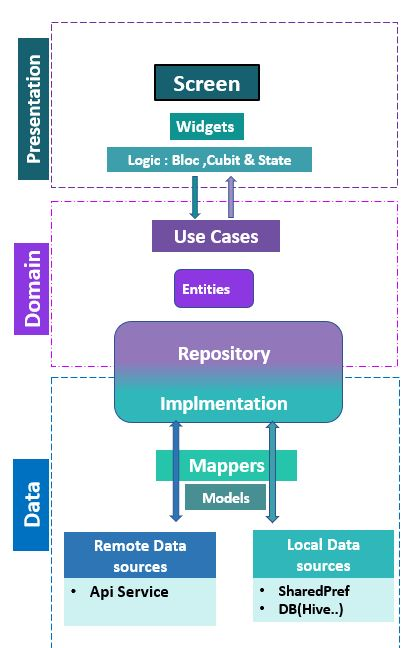

## 🧠 Overview

This project follows **Clean Architecture** principles with a **modular folder structure**, ensuring clear separation of concerns, testability, and scalability.

Clean Architecture divides the code into three main layers:

* **Data**
* **Domain**
* **Presentation**

Each layer has a specific responsibility. The modular design enables reusable core logic and feature-based isolation, making the project easy to navigate and maintain as it grows.

---

## 📁 Project Structure

### 🔹 Core Layer (Shared Modules)

At the heart of the architecture is the core layer — a centralized place for reusable components and app-wide configurations.
The `core` directory contains shared resources and base configurations used across the entire app, including:

* **Base classes**: `BaseLocalDataSource`, `BaseRemoteDataSource`, `BaseState<T>`
* **Dependency injection** (`di/`) with `getIt`
* **Helpers**: `SharedPrefHelper`, Dart extensions
* **Services**: `HiveService`, etc.
* **Routing**: `AppRouter`, route names, guards
* **Theming**: Colors, typography, dimensions, and assets
* **Utils**: App-wide constants and strings (`AppStrings`, `AppConsts`, etc.)
* **Widgets**: Reusable UI components (custom fields, buttons, dialogs, etc.)

---

### 🔹 Features Layer

Organized per feature, with separation into `data`, `domain`, and `presentation`:

#### 📦 `data/`

Handles local and remote data sources:

* `datasources/`

  * `local/`: Models, `LocalDataSource`, implementation
  * `remote/`: Models, `RemoteDataSource`, implementation
* `mappers/`: Transforms between models and entities
* `repositoryImpl/`: Implements domain contracts

#### 📦 `domain/`

Pure business logic:

* `repository/`: Abstract data operation contracts
* `entities/`: Core domain models
* `usecases/`: Specific business actions (e.g., `LoginUseCase`)

#### 📦 `presentation/`

User interface layer:

* `cubit/`: Cubits and UI states
* `widgets/`: Feature-level reusable widgets
* `screen/`: Screens like login, sign-up, home, etc.

  

---

## 🎓 Technologies & Dependencies

Here are the main packages used in this project and what they do:

### ✨ UI & Layout

* **`flutter_screenutil`**: Responsive design by adapting layout and font size.
* **`flutter_svg`**: Renders SVG assets.
* **`shimmer`**: Adds shimmer loading effects.
* **`marquee`**: Scrolling text widget.

### 🎓 State Management

* **`flutter_bloc`**: Bloc & Cubit-based reactive state management.

### ⚙️ Dependency Injection

* **`get_it`**: Simple service locator for DI.

### 🚀 Networking

* **`dio`**: Powerful HTTP client.
* **`retrofit`**: Type-safe REST API client generator.
* **`pretty_dio_logger`**: Logs network requests in development.

### 📂 Local Storage

* **`shared_preferences`**: Store simple key-value pairs.
* **`flutter_secure_storage`**: Encrypted key-value storage.
* **`hive` / `hive_flutter`**: Lightweight and fast NoSQL database.
* **`path_provider`**: Access filesystem paths for data storage.

### ⚛️ JSON & Code Generation

* **`json_serializable` / `json_annotation`**: JSON (de)serialization.
* **`freezed` / `freezed_annotation`**: Data classes & sealed unions.

### 📸 Media

* **`image_picker`**: Pick images from camera or gallery.
* **`cached_network_image`**: Load and cache network images.

### 🎡 Platform & Misc

* **`cupertino_icons`**: iOS-style icons.
* **`flutter_native_splash`**: Configure native splash screen.
* **`dartz`**: Functional programming tools and data types.

---
